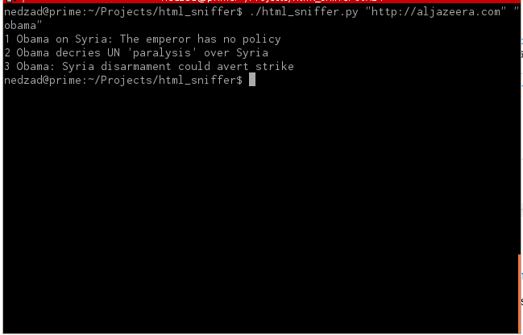

html_sniffer
============

This tool loads html from URL search for string and show you that string with offsets defined in arguments

USAGE
=====
html_sniffer.py [url] [search_string] [starting offset] [ending offset]

REQUIRES FOLLOWING: pymongo and MongoDB installed 

EXAMPLE
=======

python html_sniffer.py http://www.aljazeera.com "obama" 0 100

Screenshot

